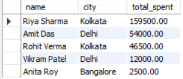
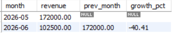
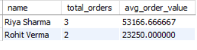

# E-Commerce SQL Analytics

Solved 5 real business questions using MySQL on an e-commerce database. Used JOINs, GROUP BY, subqueries, CTEs, and Window Functions to find top customers, revenue trends, and product insights.

### Tech Used
**MySQL 8.0**

### Key Queries Solved
1. **Top 5 Customers by Spend** - Found highest value customers using JOIN + GROUP BY
2. **Monthly Revenue Trend** - Tracked sales performance with DATE_FORMAT
3. **Products Never Ordered** - Identified dead inventory using LEFT JOIN + NULL
4. **VIP Customers in Kolkata** - Used CTE to filter customers with avg order > 5000
5. **Category Bestsellers** - Ranked products per category with RANK() Window Function

### Query 1: Top 5 Customers by Spend

### Query 2: Monthly Revenue Trend

### Query 4: VIP Customers in Kolkata

### Query 5: Category Bestsellers

### How to Run This Project
1. Clone repo: `git clone https://github.com/Anushri202406/sql-ecommerce-analytics.git`
2. Open MySQL Workbench
3. Run `schema_and_data.sql` first to create tables
4. Run `business_queries.sql` to see all 5 business insights